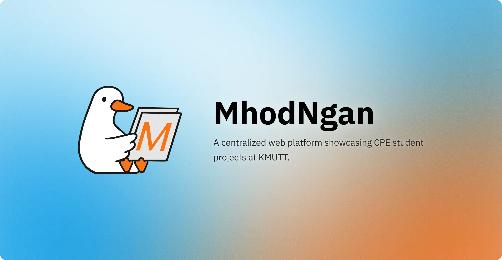
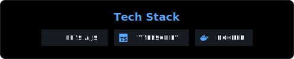

<h1 align="center">MhodNgan Backend</h3>




<p align="center">By <b>ทีมงานคุณภาพศูนย์วิจัยฟอร์มช่างร่างทรงนกคุ้มหลีแห่งเทคโนบางมด</b>
<br />
<a href="https://mhodngan-785868412143.asia-southeast1.run.app/openapi">📖 Explore the docs »</a>
</p>


## About The Project

MhodNgan Backend API service built with Elysia.js and Bun runtime.

<p align="center">
  
</p>

## Getting Started

### Prerequisites

- [Bun](https://bun.sh/) >= 1.0.0

### Installation

1. **Clone the repository**
   ```bash
   git clone https://github.com/mhodngan-kmutt/mhodngan-kmutt-backend.git
   cd Mhodngan-backend
   ```

2. **Install dependencies**
   ```bash
   bun install
   ```

3. **Run development server**
   ```bash
   bun run dev
   ```

4. The server will start at [http://localhost:3000](http://localhost:3000)

## To-do list
- [x] Setup Google Cloud Run Deployment
- [x] Initialize API documentation
- [ ] Setup CI/CD with GitHub Actions
- [ ] Setup Project Folder Structure
- [ ] Integrate with Supabase

## License

This project is licensed under the MIT License - see the [LICENSE](LICENSE) file for details


```
Built with ❤️ by ทีมงานคุณภาพศูนย์วิจัยฟอร์มช่างร่างทรงนกคุ้มหลีแห่งเทคโนบางมด
```